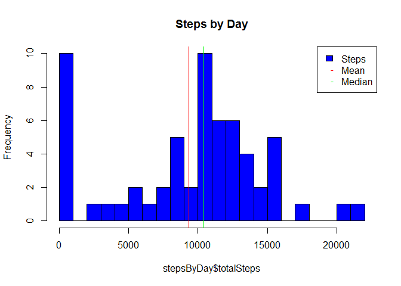
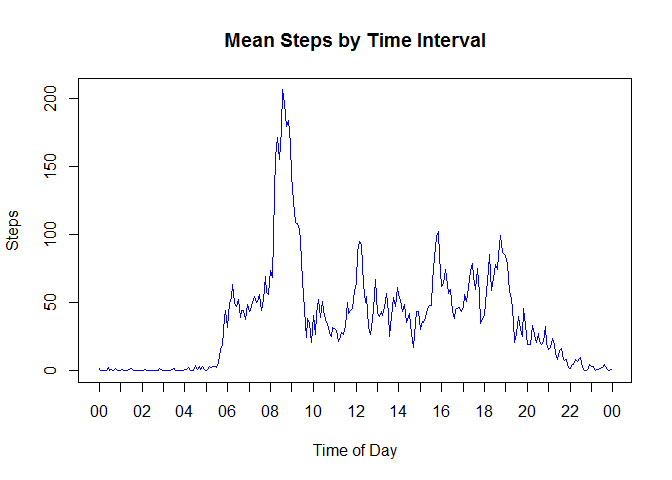
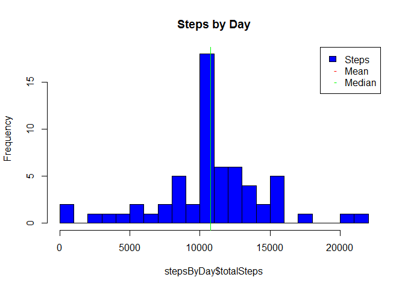
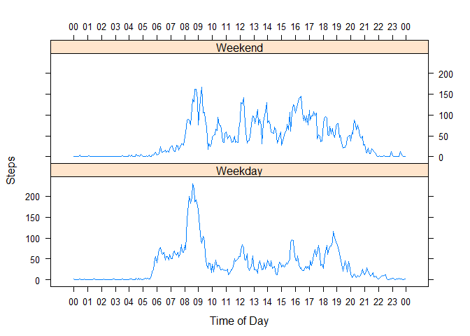

# Reproducible Research: Peer Assessment 1


## Loading and preprocessing the data

The activity file was loaded, and for the purpose of this assignment the dates where converted to a Date format, and the interval was converted to a POSIXlt format, with an arbitrary Date of 1/1/2000, and the time.


```r
require(plyr)
require(lattice)

activity <- read.csv(unz("activity.zip", filename="activity.csv"))
activity$date <- as.Date(activity$date)
activity$time <- as.POSIXlt((activity$interval%/%100)*60*60 + (activity$interval%%100)*60, origin="2000-01-01", tz="UCT")
hours <- as.POSIXlt((0:24)*60*60, origin="2000-01-01", tz="UCT")
```

## What is mean total number of steps taken per day?


```r
stepsByDay <- ddply(activity, .(date), summarize, totalSteps=sum(steps, na.rm=T))
#stepsByDay <- stepsByDay[stepsByDay$totalSteps>0,]

hist(stepsByDay$totalSteps, breaks=20, col="blue", main="Steps by Day")
meanSteps=mean(stepsByDay$totalSteps)
abline(v=meanSteps, col="red")
medianSteps=median(stepsByDay$totalSteps)
abline(v=medianSteps, col="green")
legend("topright", legend=c("Steps", "Mean", "Median"), fill=c("blue", NA, NA), col=c(NA, "red", "green"), pch=c(NA, "-", "-"), border=c("black", NA, NA))
```

 

The mean number of steps taken was 9,354 and the median number of steps taken was 10,395.

## What is the average daily activity pattern?


```r
stepsByInterval <- ddply(activity, .(interval, time), summarize, meanSteps=mean(steps, na.rm=T))
stepsByInterval <- stepsByInterval[order(stepsByInterval$interval),]

plot(stepsByInterval$time, stepsByInterval$meanSteps, type="l", main="Mean Steps by Time Interval", col="blue", xlab="Time of Day", ylab="Steps", xaxt="n")
axis.POSIXct(1, at=hours, label=format(hours, "%H"))
```

 

```r
maxMeanSteps = max(stepsByInterval$meanSteps)
maxStepsAtTime <- stepsByInterval$time[stepsByInterval$meanSteps == maxMeanSteps]
```

The maximum average number of steps, 206.17 was taken during the 5 minute time interval starting at 08:35.  This would seem to indicate that the activity peaks in the morning, possibly on the way to an office or job.

## Imputing missing values

First I check how many rows have missing (NA or NULL) values.  I start by checking by column in case more than one column has NA's or NULL's.


```r
sapply(names(activity), function(name) { sum(is.na(activity[,name]))})
```

```
##    steps     date interval     time 
##     2304        0        0        0
```

```r
sapply(names(activity), function(name) { sum(is.null(activity[,name]))})
```

```
##    steps     date interval     time 
##        0        0        0        0
```

This demonstrates that  the **steps** column is the only column with missing values and that they are only **NA**'s.  The number of rows with missing values is 2,304.


I have decided to impute the values by looking up the mean number of steps for the interval, calculated in the previous step.


```r
activity$steps[is.na(activity$steps)] <- sapply(activity$interval[is.na(activity$steps)], function(interval) { mean(stepsByInterval$meanSteps[stepsByInterval$interval==interval]) })
## Check that this value is zero
sum(is.na(activity$steps))
```

```
## [1] 0
```


```r
stepsByDay <- ddply(activity, .(date), summarize, totalSteps=sum(steps, na.rm=T))
#stepsByDay <- stepsByDay[stepsByDay$totalSteps>0,]

hist(stepsByDay$totalSteps, breaks=20, col="blue", main="Steps by Day")
meanSteps=mean(stepsByDay$totalSteps)
abline(v=meanSteps, col="red")
medianSteps=median(stepsByDay$totalSteps)
abline(v=medianSteps, col="green")
legend("topright", legend=c("Steps", "Mean", "Median"), fill=c("blue", NA, NA), col=c(NA, "red", "green"), pch=c(NA, "-", "-"), border=c("black", NA, NA))
```

 

The mean number of steps taken is now 10,766 and the median number of steps taken is now 10,766.

## Are there differences in activity patterns between weekdays and weekends?


```r
activity$partOfWeek <- ifelse(weekdays(activity$date) %in% c("Saturday", "Sunday"), 
                              "Weekend", "Weekday")
stepsByIntervalPartOfWeek <- ddply(activity, .(time, partOfWeek), summarize, meanSteps=mean(steps, na.rm=T))
stepsByIntervalPartOfWeek <- stepsByIntervalPartOfWeek[order(stepsByIntervalPartOfWeek$time),]
xyplot(meanSteps  ~ as.numeric(time) | partOfWeek, data = stepsByIntervalPartOfWeek, label = "Weekday vs Weekend activity comparison", xlab="Time of Day", ylab="Steps", type="l", scales=list(x=list(at=as.numeric(hours), labels=format(hours, "%H"), alternating=3)), layout=c(1,2))
```

 

From the above charts it would appear the activity is much more pronounced in the mornings leading up to 9am on weekdays, whereas it tends to be spread more evenly throughout the day on the weekends.
